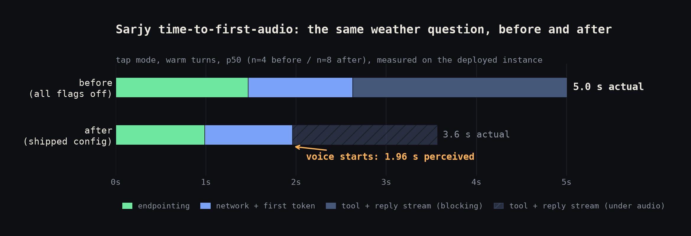
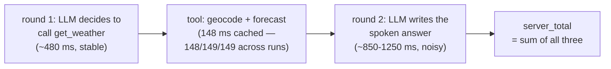

# Sarjy — Latency Deep Dive (Time-to-First-Audio)

The working document for Phase 2. Populated as each attack lands; nothing
here is claimed without a stored bench run or labeled dashboard data behind
it.

## Metric definitions

- **TTFA (actual):** speech end → first audio of substantive content.
- **TTFA (perceived):** speech end → first audio of any speech, including
  tool acknowledgments. Never conflated with actual.
- **Speech end is defined per input mode** — `hold`: the mic/space release
  (explicit signal, endpointing ~0); `tap`: VAD-detected silence; `typed`:
  submission time. Distributions are never mixed across modes.
- Every turn labeled `warm`/`cold` (server-side: cold = first LLM call in
  60s) and `tool`/`no-tool`. p50/p95 over N runs; no single-turn anecdotes.
- Every metrics row and bench run stores a `config_snapshot` (all OPT_*
  flags, model, endpointing threshold, input mode), so each improvement is
  attributable to the flag that caused it.
- **Provider stalls and outlier handling:** OpenAI first-token stalls form
  a separate population (observed at 6.2 s, 6.8 s, 12-28 s, and 61 s; the
  normal TTFT population sits at 350-1500 ms, nothing in between), so
  TTFT > 3000 ms is classified as a stall. Primary tables always include
  every turn; where a stall landed inside a run, a stall-excluded value is
  given alongside, labeled. Medians were unaffected in every case —
  exactly why p50 is the primary statistic — only p95s at small N were
  hostage to single stalls. Stalls are never deleted from the data: they
  are an operational class with their own mitigation (first-token timeout
  and retry, next-week list).

  Full stall census (every turn, both instruments, TTFT > 3 s): seven
  specimens — 3221 / 6178 / 6769 / 12210 / 12832 / 28252 / 60883 ms —
  out of ~340 measured turns, a ~2% rate. Five of the seven hit
  warm-labeled paths (including the 61 s one), confirming the class is
  orthogonal to connection warming. The earliest specimen (3221 ms) is
  the turn behind the human baseline's hold/no-tool p95 of 4325 — at
  n=9, one stall owned that cell. Three landed in a single 90-second
  window after a long idle period, suggesting provider-side episodes
  rather than independent events. Implication for production: a
  first-token timeout near 3 s with one retry would have converted every
  specimen into roughly a one-retry delay.

## Input modes: explicit signal beats VAD

Hold-to-talk releases give an exact, free speech-end signal — endpointing
cost is ~0 by construction, which makes hold turns the control group.
Tap mode pays the endpointing wait (first anecdote ~865 ms; the manual
protocol below measured p50 ~1.4 s on Chrome's native endpointer), and
Attack 3's threshold curve is the price of going hands-free: phone calls
and smart speakers have no spacebar.

Note on old data: all metrics collected before the input-mode label (and
before the VAD, in the earliest rows) were discarded — they were measured
with three different rulers and could not be relabeled honestly.

## Baseline (Phase 1 pipeline, all OPT_* flags off)

Anecdotal reference: the recorded demo's warm weather turn showed ~4.1 s
TTFA (tap mode, Chrome endpointer), decomposed as ~865 ms endpointing,
~0.5 s warm TTFT, ~1.25 s weather tool, ~2.1 s stream tail, ~10 ms TTS.

Canonical baseline bench runs (synthetic hold mode, server+network stages):

### Local (iteration reference only)

`baseline-local`, bench_run id=1 (local DB), N=10, synthetic hold mode, ms:

| stage | short p50 | short p95 | long p50 | long p95 | weather p50 | weather p95 |
| --- | --- | --- | --- | --- | --- | --- |
| send to first byte | 648 | 1546 | 508 | 582 | 662 | 2096 |
| server TTFT | 647 | 1545 | 507 | 581 | 595 | 1990 |
| server tools | 0 | 0 | 0 | 0 | 147 | 681 |
| server total | 734 | 1757 | 1000 | 1130 | 1688 | 3055 |
| first sentence ready | 725 | 1705 | 672 | 748 | 1563 | 2919 |
| full stream done | 735 | 1758 | 1001 | 1131 | 1690 | 3056 |

Early reads (local only, do not headline): pipelining's gap (first sentence
vs full stream) is ~330 ms p50 on long answers and ~10 ms on one-sentence
answers — the win scales with reply length. The weather tool cost only
~150 ms p50 from this machine vs ~1250 ms measured from Railway — network
path dominates tool cost, which is exactly why headline numbers only come
from the deployed instance.

### Deployed (the headline baseline)

`baseline-prod`, bench_run id=1 (prod DB), N=10, synthetic hold mode, all
flags off, ms:

| stage | short p50 | short p95 | long p50 | long p95 | weather p50 | weather p95 |
| --- | --- | --- | --- | --- | --- | --- |
| send to first byte | 705 | 2205 | 630 | 1312 | 759 | 919 |
| server TTFT | 453 | 1405 | 380 | 1038 | 454 | 614 |
| server tools | 0 | 0 | 0 | 0 | 309 | 2140 |
| server total | 647 | 1510 | 936 | 1435 | 1714 | 3376 |
| first sentence ready | 756 | 2409 | 835 | 1442 | 1711 | 3456 |
| full stream done | 922 | 2409 | 1183 | 1688 | 1978 | 3664 |

Reads:
- Audio-ready floor without pipelining (hold mode, plus ~10 ms TTS):
  ~0.9 s short / ~1.2 s long / ~2.0 s weather at p50. The warm no-tool
  target (<1.5 s actual) looks reachable; the tool-turn perceived target
  rides on Attack 2's acknowledgments.
- Pipelining gap (full stream vs first sentence): ~350 ms p50 on long
  answers, ~270 ms on weather turns.
- Weather tool: p50 309 ms but p95 2140 ms from Railway — heavy tail
  (likely connection setup to Open-Meteo); the geocode cache and a shared
  keep-alive pool should compress it.
- Warm TTFT from Railway (380-455 ms p50) beats local (~500-650 ms) —
  Railway sits closer to OpenAI than a Cairo ISP does.

### In-browser client stages (manual protocol)

Human baseline on the deployed instance, 2026-06-12, one speaker/mic/room,
fixed phrases, all flags off. Warm turns only (cold singletons noted), ms:

| condition | n | TTFA p50 | TTFA p95 | endpoint p50 | send to 1st byte p50 | stream p50 | tts p50 |
| --- | --- | --- | --- | --- | --- | --- | --- |
| tap, no-tool | 9 | 2909 | 3391 | 1427 | 824 | 494 | 4 |
| hold, no-tool | 9 | 1356 | 4325 | 139 | 747 | 531 | 4 |
| tap, weather | 4 | 4991 | 5113 | 1470 | 1158 | 2378 | 6 |
| hold, weather | 5 | 3265 | 4238 | 118 | 998 | 2150 | 4 |

(plus one cold turn in each condition — n=1 anecdotes, not distributions;
the cold hold/weather turn landed at 4645 ms TTFA with a 3633 ms stream
stage, consistent with cold-connection costs hitting both OpenAI and
Open-Meteo on the same turn)

Findings:

- **Chrome's endpointer costs ~1.3 s, measured on a human.** Tap endpoint
  p50 is 1427-1470 ms vs 118-139 ms for an explicit hold release (which is
  just the forced-finalize cost). The early single-turn anecdote said
  ~865 ms; the distribution says it's worse. Same phrase, same network,
  same model: hold beats tap by ~1.55 s p50 — that is Attack 3's prize and
  its control group in one table.
- **Hold no-tool is already at 1356 ms p50 TTFA with zero optimizations** —
  under the 1.5 s target. The honest framing: explicit endpointing alone
  nearly clears the warm no-tool target; the optimizations have to win the
  tap path and the tool path.
- **TTS engine is 4-13 ms across all 30 human turns** — browser synthesis
  confirmed negligible at distribution level, not just anecdote.
- **Recognition start-up clips speech in hold mode.** 3 of 10 hold turns
  lost their first syllables ("me something interesting...") because
  SpeechRecognition takes a beat to open the stream after the press, and
  hold users start talking immediately. A ready cue (short beep when
  capture actually starts) is parked in IDEAS.md — a real UX cost of
  push-to-talk that tap mode hides.

## Attack log

One section per attack: what changed, the flag, before/after p50/p95 table
(stored bench run ids), verdict, and anything that failed and why.

### Attack 1 — sentence-level TTS pipelining (OPT_SENTENCE_PIPELINING)

**Mechanism:** stop waiting for the full LLM response — buffer the token
stream only to the first sentence boundary, hand that sentence to
`speechSynthesis` immediately, queue later sentences as they complete.
Conservative splitter (terminal punctuation + whitespace lookahead, so
decimals can't split; 12-char minimum first flush; Arabic `؟` handled;
remainder flushed at stream end). Side effect that became a feature:
barge-in now aborts the in-flight request (`AbortController`), because
once audio starts mid-stream, canceling only the audio would leave the
stream feeding the utterance queue.

**Server stages: unchanged, by measurement.** Bench run 1 (flag off) vs
run 2 (flag on): deltas of +10/-67/+114 ms scattered in both directions
across stages the client-side flag cannot touch — noise, dismissed in both
directions (see DECISIONS, two-instruments entry). Pipelining is pure
client-side reshaping; the server does identical work.

**Human before/after (warm, p50, same phrases/speaker/mic):**

| condition | flag off | flag on | delta | n |
| --- | --- | --- | --- | --- |
| tap, no-tool | 2909 | 2522 | -387 | 9/10 |
| hold, no-tool | 1356 | 1229 | -127 | 9/9 |
| hold, weather | 3265 | 3086 | -179 | 5/4 |
| tap, weather | 4991 | 4229 | -762* | 4/4 |

Attribution control held in every condition: endpointing within noise of
baseline (e.g. 1423 vs 1427 ms on tap). *The tap/weather -762 overstates
the mechanism: at n=4 per side, ~-280 ms of it is send-to-first-byte
variance; the defensible pipelining share is ~-200 ms, consistent with the
other conditions and the bench prediction.

**Hold no-tool now clears the warm target: 1229 ms p50 (target < 1500).**

**The win scales with speakable tail, not with anything else.** Long chatty
answers gave -387 ms; terse answers gave -127. And a prediction failure
worth keeping: weather turns were predicted (verbally) to gain "over a
second" — they gained ~180 ms, exactly what the bench's
first_sentence_ready vs full_stream_done gap (~150-250 ms) had already
said. A weather turn's big stream stage is the tool call plus the second
LLM round's first token, not speakable tail; sentence one cannot exist
before the weather data does. Lesson recorded: trust the instrument over
the hand-wave. The weather turn's real lever is Attack 2 (speak during the
tool call; shrink the tool itself).

### Attack 2 — tool acknowledgments (OPT_TOOL_ACK) + geocode cache (OPT_GEOCODE_CACHE)

**Mechanism A — perceived:** on a tool call the server emits a templated
`tool_ack` event ("Checking the weather in Cairo.") that the client speaks
immediately. No extra LLM call — the city is interpolated from the
already-parsed tool arguments. The ack is the first event out of round 1,
so audio starts at first byte. It counts toward TTFA (perceived) only;
`t_first_audio_content` keeps actual honest. `remember_fact` is
deliberately not acknowledged: the tool finishes in ~15 ms and an ack
would outlast it.

**Mechanism B — actual:** city coordinates never change, so geocoding
results are cached in SQLite (keyed on the lowercased city); a hit skips
one of the weather tool's two HTTP calls.

Bench evidence, weather turns, N=10 warm each (runs 1, 3, 4 — one flag
flipped per step):

| stage (ms) | baseline | +ack | +ack+cache |
| --- | --- | --- | --- |
| ack_ready p50 | — | 807 | 815 |
| server_tools p50 | 309 | 310 | 149 |
| server_tools p95 | 2140 | 1255 | 1256 |
| full_stream_done p50 | 1978 | 2263 | 1963 |

- **Ack: the perceived audio floor equals first byte (~810 ms from speech
  end)** vs ~2-2.3 s for content — roughly a 1.4 s perceived win at zero
  server cost (tools 309 vs 310 is the control holding).
- **Cache: tool p50 down 52%** (310 to 149), the geocode call's share.
- **The tool's p95 tail did not move** (1255 vs 1256): the tail belongs to
  the forecast call's connection setup, which a geocode cache cannot
  touch. That tail is Attack 4's keep-alive target — and note the warm
  pool must cover Open-Meteo, not just OpenAI.
- full_stream_done wobble across runs (1978/2263/1963) is reply-length
  noise; no mechanism, no claim.

**Human validation (spoken weather turns, ack+cache on, warm p50):**

| | hold (n=4) | tap (n=4) |
| --- | --- | --- |
| TTFA perceived | 1021 | 2474 |
| TTFA actual | 2605 | 4057 |
| endpointing | 128 | 1410 |
| tool | 589 | 590 |

- **Tool-turn perceived target (< 2 s p50): PASSED in hold mode at
  1021 ms** — audio starts about a second after the spacebar releases.
- Actual improved too: hold weather 3265 to 2605 vs baseline (pipelining
  ~180 plus cache ~600 compounding); the cache's halving of tool time
  reproduces in human turns (~1230 to ~590 ms).
- Tap misses the perceived target at 2474 ms, and the decomposition says
  why: 1410 ms is endpointing — Attack 3's territory.
- The tap set also caught a 10.3 s outlier turn: server TTFT of 6769 ms,
  every other stage normal — an OpenAI first-token stall. The ack cannot
  hide it (the stall precedes the first byte the ack rides on).
  Mitigations (first-token timeout-and-retry, speculative filler) go in
  the next-week list; the turn stays in the data as what provider tails
  look like.

### Attack 3 — endpointing threshold, tap mode only (OPT_VAD_ENDPOINT)

**Mechanism:** our mic-energy VAD force-stops recognition after N ms of
measured silence instead of waiting out Chrome's endpointer, guarded by
250 ms of interim-transcript stability. Tap mode only; hold turns
(explicit release, ~130 ms) are the control group and the escape hatch.

**The curve (endpoint stage p50, human tap turns, artifacts excluded):**

| setting | endpoint p50 | vs native |
| --- | --- | --- |
| native Chrome | ~1430 ms | — |
| 600 ms | ~940 ms | -490 |
| 400 ms | ~503 ms | -930 |
| 300 ms | ~590 ms | no better than 400 |

**Gains are linear down to 400 ms, then floor.** Below 400 the binding
constraints are the interim-stability guard plus Chrome's finalize cost
(~400-500 ms combined) — you cannot endpoint faster than the recognizer
produces stable transcript. 300 buys risk for zero reward.

**Clipping is deterministic, not probabilistic: the threshold IS the
maximum mid-sentence thinking pause.** Controlled pause tests (silent
pause immediately before the final word, so a clip is unambiguous):

| setting | pause ~1 s | pause ~0.5 s |
| --- | --- | --- |
| 600 ms | clipped 3/3 (1 s > 600 ms, by definition) | survived ~3/4 |
| 400 ms | (redundant — clips by the same arithmetic) | clipped 3/3 |

The 600/0.5 s miss came from natural pause-length variance, not the
mechanism. Natural fluent phrases at 400 almost never clipped (1 of ~11),
so the threshold choice is a persona decision: 400 for decisive speech,
600 as the humane default for hesitant first-time users, hold mode for
deliberate thinkers. **Shipped default: 600** (demo users hesitate).

**Effect on TTFA:** healthy warm tap no-tool turns reached ~1.4-1.8 s at
the 400 setting (median ~1.5-1.6 s, grazing the actual target) and
~1.9-2.2 s at 600 — versus 2522 ms with native endpointing.

**Measurement honesty, artifacts observed and excluded:** trailing noise
near finalize compresses the endpoint stage to absurd lows (1/17/66/92/103
ms turns — sound resets the VAD's last-voice stamp); recognition start-up
clips first syllables when speech begins immediately after the tap (the
hold-mode disease appearing in tap; ready-cue idea in IDEAS.md); one turn
where Chrome finalized before our threshold fired; and one ASR mishear
("coffee" -> "cough") that produced a confident answer about coughing —
a reminder that latency is not the only axis of voice-turn quality.

**Bonus capture:** the 600-setting batch caught a cluster of OpenAI
first-token stalls right after ~2.5 h of idle — TTFT of 28.3 s, 12.2 s,
12.8 s on consecutive turns, every other stage normal. Strongest possible
motivation data for Attack 4's keep-alive and pre-warm.

### Attack 4 — cold start: keep-alive (OPT_KEEPALIVE), pre-warm (OPT_PREWARM), prefix caching

**Cold TTFT, bench runs 5-9 (short no-tool, N=5 each, 65 s idle before
every turn), ms:**

| arm | run | TTFT p50 | TTFT p95 |
| --- | --- | --- | --- |
| cold baseline | 5 | 693 | 1473 |
| keepalive, GET ping (pool broken) | 7 | 579 | 1719 |
| keepalive, GET ping (pool fixed) | 8 | 642 | 827 |
| pre-warm (1-token completion at load) | 6 | **473** | 815 |
| keepalive, 1-token completion ping | 9 | **494** | 6178* |

*one provider first-token stall (6178 ms) landed in run 9 — the orthogonal
tail class observed at 6.8 s and 28 s; no client-side warming prevents it.
Stall-excluded (criterion: TTFT > 3 s, n=4): p50 unchanged at 494, p95 798
— statistically identical to pre-warm's 815. The two warmers are tied at
both percentiles; the apparent tail difference was entirely one stall.

**The falsification arc, in order:**

1. GET-ping keepalive did nothing (run 7 vs 5). Root cause: httpx expires
   idle pooled connections after 5 s by default (`keepalive_expiry`), so a
   45 s ping can never keep a connection alive. A correct technique
   defeated by an unread library default.
2. Pool fixed (`keepalive_expiry=75`): the tail collapsed (p95 1473 to
   827 — connection-setup spikes gone) but the median barely moved.
   Conclusion forced by the data: **warmth is a serving-path property, not
   a connection property** — the median cold cost lives on the provider's
   side and only a real completion refreshes it.
3. Ping replaced with a 1-token completion: cold-labeled turns hit
   warm-level medians (494 vs warm ~470). Cost: ~1 token per 45 s,
   roughly 2k tokens/day — fractions of a cent.

**Pre-warm** (page-load `POST /warmup`, one 1-token completion) covers the
fresh-arrival case: the warmup call absorbs the cold cost (~1.8 s measured)
inside the dead time between page load and first utterance. Both flags
shipped on; they cover complementary idle patterns.

**Prefix caching: null by precondition, as pre-registered.** The prompt was
already ordered stable-first (system text, then memory facts, volatile
content last), but OpenAI's automatic prompt caching activates at ~1024+
prompt tokens and Sarjy's prompt is ~300. There is nothing to measure
until the prompt grows 3x; recorded as a non-experiment rather than padded
into a fake one.

**Honesty note on cold depth:** these arms measure 65-second cold. The
12-28 s stalls arrived after 2.5 hours idle — a deeper cold (and possibly
a different mechanism) that is uneconomical to sample at N=5. The claim is
scoped to the common case.

### Attack 5 (stretch) — model TTFT A/B through the provider seam

Three models through the identical deployed pipeline, same hour, N=20 warm
turns each (short + long no-tool), bench runs 10-12:

| model | TTFT p50 | TTFT p95 | stream chars/s p50 | long-reply full stream p50 |
| --- | --- | --- | --- | --- |
| gpt-4.1-mini (incumbent) | 413 | 605 | 412 | 1438 |
| gpt-4o-mini | 463 | 668 | 340 | 1502 |
| gpt-4.1-nano | 522 | 935 | 299 | 1633 |

(A 61 s first-token stall — the largest specimen yet — landed in the
4o-mini long-turn leg; stall-excluded its long p95 is 1751 ms, medians
unchanged, verdict unaffected.)

The incumbent wins every axis, and the notable finding is that **smaller is
not faster**: nano trails mini by ~110 ms TTFT and ~27% streaming
throughput. At this scale, serving infrastructure and capacity allocation
dominate model size. Model choice is a real latency lever — the data just
says we already hold the right one, which would have been wrong to assume
in either direction. Caveats: one same-hour sweep, warm turns only, latency
axis only (reply quality and tool-calling reliability unmeasured; the
incumbent is also the strongest of the three there, making the decision
one-sided). No change shipped; the provider seam earned its existence by
making this a 15-minute verification.

## Failed experiments

(populated as they happen — a measured null result with a kept-but-off
toggle is a deliverable, not a waste)

## Targets — final verdict (shipped config: all six flags on, threshold 600)

| target (p50) | hold | tap |
| --- | --- | --- |
| warm no-tool < 1.5 s TTFA (actual) | **PASS — 1229 ms** (n=9) | ~1.5-1.6 s at the 400 threshold (grazing); ~2.1 s at the shipped 600 |
| tool turn < 2 s TTFA (perceived) | **PASS — 1021 ms** (n=4) | **PASS — 1961 ms** (n=8, final validation at shipped config) |

Three of four cells pass on human data. The fourth — tap no-tool actual —
is a documented product tradeoff, not an unexamined miss: the shipped 600 ms
threshold spends ~500 ms of speed to tolerate human hesitation (Attack 3's
deterministic clip law), and the console slider demonstrates the 400 ms
setting reaching the target live. Hold mode passes everything with margin.

End-to-end arc: the Phase 1 demo's tap weather turn measured ~4.1 s TTFA.
The same turn class at shipped config: **1.96 s perceived / ~3.5 s actual
(tap), ~1.0 s perceived (hold)** — and the final 8-rep validation showed
zero stalls, all-warm paths, and tool times within a 4 ms spread.

(Chart built from the measured p50s above by `charts/build_charts.py`.)

## The wins, by instrument

Five of the six optimizations act on the client or on perception, which a
headless bench cannot see — so the scoreboard spans both instruments. One
view of every win and the instrument that measured it:

| win | metric (instrument) | before | after |
| --- | --- | --- | --- |
| tap endpointing | endpoint stage p50 (human) | ~1430 | 940 @600 / 503 @400 |
| tool turns, perceived | TTFA perceived p50 (human) | — (nothing spoke early) | 1961 tap / 1021 hold |
| no-tool TTFA, actual | p50 (human) | 2909 tap / 1356 hold | 2522 / 1229 |
| weather tool cost | server tools p50 (bench) | 310 | 148, tail deleted |
| cold first token | TTFT p50 (bench) | 693 | 473 prewarm / 494 keepalive |

The server bench below is the **control, not the scoreboard**: it verifies
that the only server-side stages that moved are the ones with mechanisms,
and that nothing regressed underneath the client-side wins.

## Final bench: all flags off vs all flags on (server-side control)

The first attempt (runs 1 vs 13, taken 11 hours apart) became the closing
methodology lesson instead of the headline: stages no flag touches showed
+16-22% "regressions". Reply lengths were identical (294 vs 293 chars p50
on long turns), but provider throughput had dropped 40% between 04:40 and
15:50 (614 to 367 chars/s) — time-of-day drift painting losses onto an
unchanged pipeline. Benchmark pairs must share a time window; Attack 5's
model sweep did this deliberately, and the headline pair was re-taken to
match (the second leg also caught a Railway operational quirk: staged
variable changes can restart the service more than once, so post-flip
benches need a settle delay — the first attempt died on a mid-run 502).

**The canonical same-hour pair: run 14 (all off) vs run 15 (all on),
minutes apart, N=10 per turn type.** Weather turns, p50:

| stage | all off | all on | delta |
| --- | --- | --- | --- |
| server tools | 310 | 148 | -52% (p95 1237 to 150) |
| ack_ready (perceived audio floor) | — | 821 | new stage |
| server total | 1980 | 1478 | -501 |
| full stream done | 2254 | 1732 | -522 |

- **No-tool turns: flat, in both directions** (largest deltas -69/+83 ms)
  — correct by design. Those conditions' wins are client-side
  (endpointing, pipelining) and live in the human tables above; the bench
  proving the server didn't move is the attribution control, and the
  fake regressions of the 11-hour pair are absent.
- **Weather turns: the tool stage is the claim** — the cache halves it
  (310 to 148) and deletes its tail (p95 1237 to 150). The acknowledgment
  defines a perceived floor at ~820 ms from request start. Turn totals
  inherit the tool win but carry their own generation wobble (see the
  noise-floor rerun below); the -501 total delta in this pair flattered.
- Run 13's observation stands: with keepalive on, a fresh bench session
  produced zero cold turns.

**Noise-floor rerun (run 16, identical config to run 15):** re-running the
all-on leg unchanged reshuffled every non-mechanism delta — long-turn
first_sentence went from +83 (off vs on) to -118 (on vs on-again),
long totals swung -229 and weather totals +401 between identical configs —
while the tool stage reproduced within 1 ms (148 to 149). Two lessons,
recorded as method: (1) the same-config noise floor is ±230 ms on long
totals and ±400 ms on weather totals at N=10, and any off-vs-on cell
inside it is unclaimable in either direction; (2) the rerun retracted this
document's own earlier suggestion that warm serving "compounds into half a
second off totals" — the reproducible weather win is the tool stage; the
rest of that -501 was wobble with a flattering sign. Reproducibility is
the fingerprint of a real effect; everything else reshuffles. (A third
identical-config run confirmed: tools 148/149/149 across three runs while
totals bounced 1478/1879/1747.)

**Where the totals wobble lives.** A weather turn's `server_total` is three
phases summed, and only the middle one is ours:

The wobble is entirely round 2, driven by two factors no flag can reach:
**how many tokens the model decides to write for its free-text answer that
particular time, and OpenAI's generation throughput that minute.** Runs 15
and 16, identical config: same round 1, same tool, but round 2 cost ~850 ms
in one and ~1250 ms in the other. That is why turn totals carry a ±400 ms
floor while the tool slice inside them holds to 1 ms.

**Scope of the noise floor — what it does and does not touch.** The floor
bounds one class of claim: server turn-total deltas at N=10. The headline
wins do not live there; each rests on evidence noise cannot produce:
per-turn structure (the perceived gap exists inside every single tool
turn — the ack fires at first byte by mechanism, ~1.6 s before content,
8/8 tap and 4/4 hold); dose-response (the endpoint stage tracked the
threshold slider across three settings); exact reproduction (tool cache,
1 ms spread over three runs); convergent mechanisms (prewarm and
completion-ping keepalive independently landing at ~480 ms cold TTFT);
and cross-instrument prediction (the bench's first-sentence gap forecast
pipelining's human delta before the attack was built, and raw turns show
audio starting before stream_done). Noise can flatter or insult a
difference between two runs; it cannot do any of those five things. The
one claim that had none of these properties is the one that was retracted.

## With another week

(running list: per-user adaptive endpointing, edge deployment close to
users, speculative first clause, streaming STT to control endpointing
server-side)
