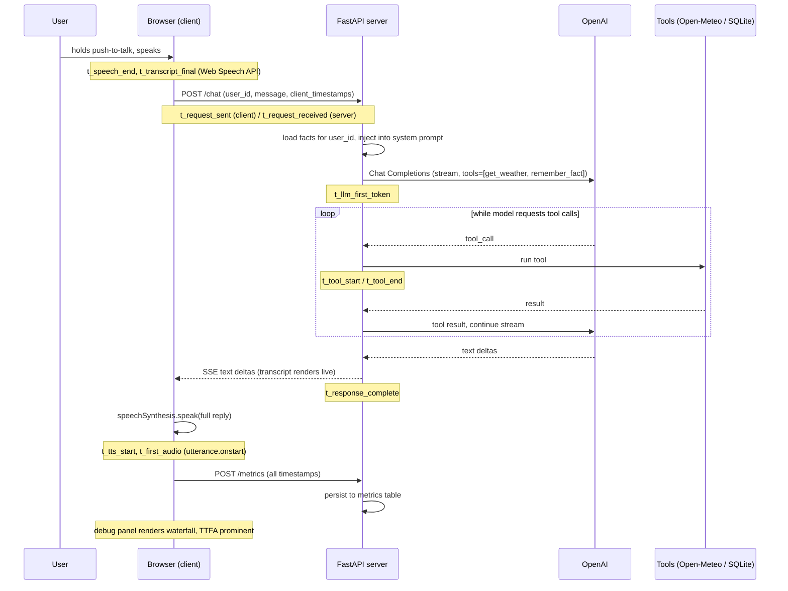

# Sarjy — Phase 1 Plan (Walking Skeleton)

## File layout

```
sarjy/
├── PLAN.md              # this file
├── DECISIONS.md         # tradeoff log (first-class deliverable)
├── IDEAS.md             # parking lot for out-of-scope ideas
├── README.md            # setup, env vars, deploy steps
├── Dockerfile
├── .env.example         # OPENAI_API_KEY=, SARJY_MODEL=gpt-4.1-mini
├── .gitignore           # .env, *.db, __pycache__
├── pyproject.toml       # uv-managed: fastapi, uvicorn, openai, httpx (+ pytest, dev)
├── uv.lock
├── app/
│   ├── __init__.py
│   ├── main.py          # FastAPI app: POST /chat (SSE), POST /metrics, serves static/
│   ├── llm.py           # OpenAI streaming + tool-calling orchestration loop
│   ├── tools.py         # get_weather (Open-Meteo geocode → forecast), remember_fact
│   ├── memory.py        # SQLite facts: save_fact, get_facts(user_id)
│   ├── metrics.py       # SQLite metrics: persist per-turn waterfall JSON
│   └── db.py            # SQLite connection + schema init (facts, metrics tables)
├── static/
│   └── index.html       # all frontend: vanilla JS, Web Speech API, debug panel
└── tests/
    └── test_memory.py   # 2–3 unit tests on the memory layer
```

One SQLite file (`sarjy.db`), two tables:
- `facts(id, user_id, fact, created_at)`
- `metrics(id, user_id, turn_json, created_at)`

## Request flow (one voice turn)



Phase 1 note on the SSE stream: the client *receives* text deltas as they
stream (so the transcript renders live and the plumbing is ready for Phase 2),
but browser `speechSynthesis` is invoked once on the complete reply — no
sentence-chunked TTS yet. That's deliberately left as the Phase 2 headline
optimization, and the baseline waterfall will show exactly what it costs.

## Server clock vs client clock

Client and server timestamps come from different clocks, so the waterfall
never mixes them in one subtraction: client-side durations use client stamps,
server-side durations use server stamps, and the network gap is shown as
(request_sent → request_received) with a note that it includes clock skew.
Time-to-first-audio itself — the headline number — is pure client-side
(`t_first_audio − t_speech_end`), so it's skew-free.

## Order of work (small commits)

1. `git init`, scaffold: pyproject (uv), .gitignore, .env.example, empty app/
2. `db.py` + `memory.py` + tests — the only tested logic
3. `tools.py` — Open-Meteo geocode + forecast via httpx, `remember_fact`
4. `llm.py` — OpenAI streaming loop with tool-call round-trips
5. `main.py` — `/chat` SSE endpoint, `/metrics`, static file serving
6. `static/index.html` — push-to-talk, transcript, status indicator, debug panel
7. Instrumentation end-to-end: server JSON-line logs + metrics table + waterfall panel
8. Dockerfile + README (local run + Railway/Fly deploy steps)
9. `DECISIONS.md` populated as each choice is made (not retrofitted at the end)

## Definition of done (from the task)

- One command runs everything locally: `uv run --env-file .env uvicorn app.main:app`
- Speak → hear reply; fact survives browser restart; weather works for any city
- Debug panel shows a real per-turn waterfall in ms
- Dockerfile builds; README complete; DECISIONS.md populated

## Dependencies

Managed with uv via `pyproject.toml`: `fastapi`, `uvicorn`, `openai`, `httpx`,
plus `pytest` as a dev-only dependency. SQLite is stdlib (`sqlite3`). SSE needs
no extra package (plain `StreamingResponse`). uv's `--env-file` flag loads
`.env`, so no python-dotenv either.

## Model

Default `gpt-4.1-mini`, configurable via `SARJY_MODEL` env var. Chosen for
fast time-to-first-token (no reasoning phase), low cost, and reliable tool
calling — for a voice assistant, TTFT dominates perceived latency, so a
reasoning model would be the wrong tradeoff. The env var makes Phase 2
model A/B comparisons free.
