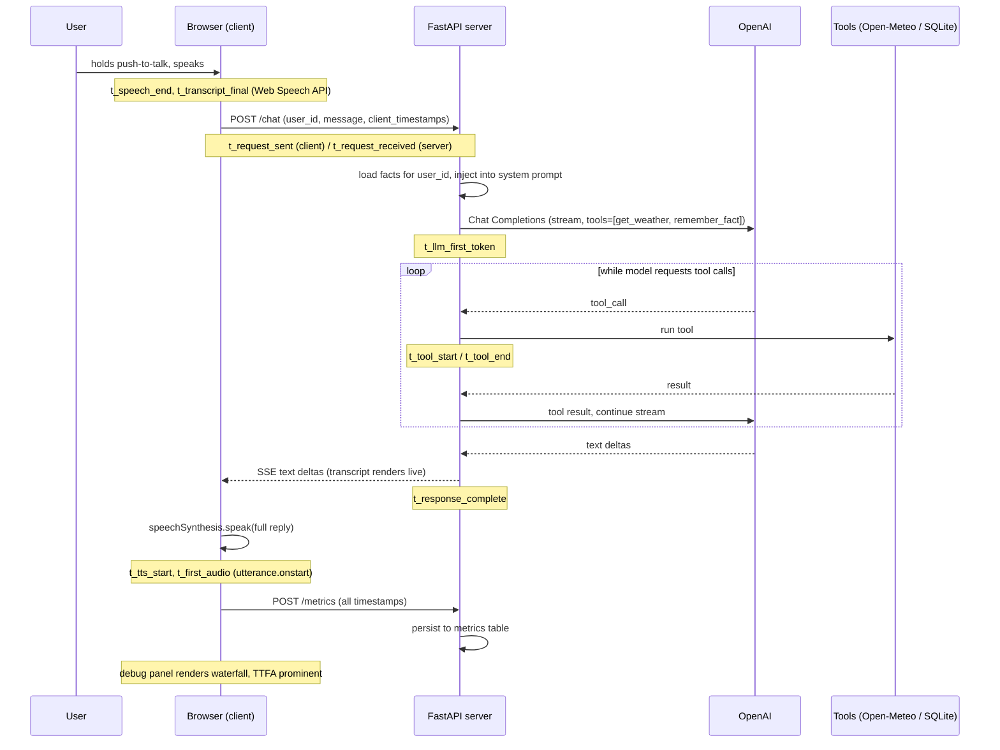
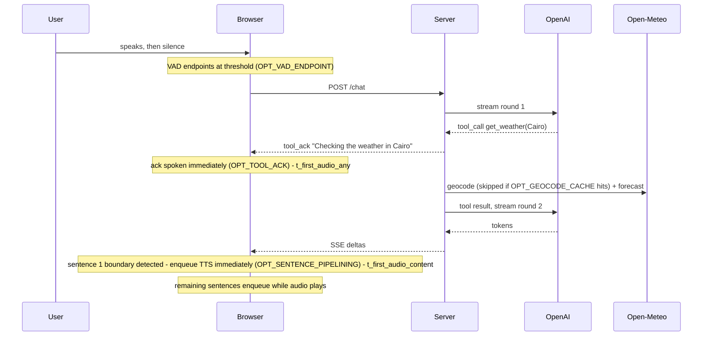

# Sarjy — Phase 1 Plan (Walking Skeleton) — complete

Phase 2 plan: see "Phase 2 — Latency Deep Dive" at the bottom of this file.

## File layout

```
sarjy/
├── PLAN.md              # this file
├── DECISIONS.md         # tradeoff log (first-class deliverable)
├── IDEAS.md             # parking lot for out-of-scope ideas
├── README.md            # setup, env vars, deploy steps
├── Dockerfile
├── .env.example         # OPENAI_API_KEY=, SARJY_MODEL=gpt-4.1-mini
├── .gitignore           # .env, *.db, __pycache__
├── pyproject.toml       # uv-managed: fastapi, uvicorn, openai, httpx (+ pytest, dev)
├── uv.lock
├── app/
│   ├── __init__.py
│   ├── main.py          # FastAPI app: POST /chat (SSE), POST /metrics, serves static/
│   ├── llm.py           # OpenAI streaming + tool-calling orchestration loop
│   ├── tools.py         # get_weather (Open-Meteo geocode → forecast), remember_fact
│   ├── memory.py        # SQLite facts: save_fact, get_facts(user_id)
│   ├── metrics.py       # SQLite metrics: persist per-turn waterfall JSON
│   └── db.py            # SQLite connection + schema init (facts, metrics tables)
├── static/
│   └── index.html       # all frontend: vanilla JS, Web Speech API, debug panel
└── tests/
    └── test_memory.py   # 2–3 unit tests on the memory layer
```

One SQLite file (`sarjy.db`), two tables:
- `facts(id, user_id, fact, created_at)`
- `metrics(id, user_id, turn_json, created_at)`

## Request flow (one voice turn)



Phase 1 note on the SSE stream: the client *receives* text deltas as they
stream (so the transcript renders live and the plumbing is ready for Phase 2),
but browser `speechSynthesis` is invoked once on the complete reply — no
sentence-chunked TTS yet. That's deliberately left as the Phase 2 headline
optimization, and the baseline waterfall will show exactly what it costs.

## Server clock vs client clock

Client and server timestamps come from different clocks, so the waterfall
never mixes them in one subtraction: client-side durations use client stamps,
server-side durations use server stamps, and the network gap is shown as
(request_sent → request_received) with a note that it includes clock skew.
Time-to-first-audio itself — the headline number — is pure client-side
(`t_first_audio − t_speech_end`), so it's skew-free.

## Order of work (small commits)

1. `git init`, scaffold: pyproject (uv), .gitignore, .env.example, empty app/
2. `db.py` + `memory.py` + tests — the only tested logic
3. `tools.py` — Open-Meteo geocode + forecast via httpx, `remember_fact`
4. `llm.py` — OpenAI streaming loop with tool-call round-trips
5. `main.py` — `/chat` SSE endpoint, `/metrics`, static file serving
6. `static/index.html` — push-to-talk, transcript, status indicator, debug panel
7. Instrumentation end-to-end: server JSON-line logs + metrics table + waterfall panel
8. Dockerfile + README (local run + Railway/Fly deploy steps)
9. `DECISIONS.md` populated as each choice is made (not retrofitted at the end)

## Definition of done (from the task)

- One command runs everything locally: `uv run --env-file .env uvicorn app.main:app`
- Speak → hear reply; fact survives browser restart; weather works for any city
- Debug panel shows a real per-turn waterfall in ms
- Dockerfile builds; README complete; DECISIONS.md populated

## Dependencies

Managed with uv via `pyproject.toml`: `fastapi`, `uvicorn`, `openai`, `httpx`,
plus `pytest` as a dev-only dependency. SQLite is stdlib (`sqlite3`). SSE needs
no extra package (plain `StreamingResponse`). uv's `--env-file` flag loads
`.env`, so no python-dotenv either.

## Model

Default `gpt-4.1-mini`, configurable via `SARJY_MODEL` env var. Chosen for
fast time-to-first-token (no reasoning phase), low cost, and reliable tool
calling — for a voice assistant, TTFT dominates perceived latency, so a
reasoning model would be the wrong tradeoff. The env var makes Phase 2
model A/B comparisons free.

---

# Sarjy — Phase 2 Plan (Latency Deep Dive)

Baseline (measured, deployed, warm weather turn): ~4.1 s TTFA. Targets:
warm no-tool < 1.5 s TTFA (actual), tool turn < 2 s TTFA (perceived), p50.
Metric vocabulary is fixed: TTFA (actual) = speech end to first audio of
substantive content; TTFA (perceived) = speech end to first audio of any
speech (acknowledgments count). Every run labeled warm/cold and tool/no-tool;
p50/p95 over N runs, never single-turn anecdotes.

Input modes (amendment): every turn and bench run carries an `input_mode`
label — `tap`, `hold`, or `typed` — and speech end is defined per mode:
hold = the mic/space release timestamp (explicit signal, endpointing ~0);
tap = VAD-detected silence (where the ~865 ms lives). The two modes are
never mixed in one distribution; hold is the control group for Attack 3,
which is scoped to tap mode only. LATENCY.md gets a section on this:
explicit signal beats VAD, and the Attack 3 tradeoff curve is the price of
going hands-free (phones and smart speakers have no spacebar).

## Optimization flags (all default off; attribution is the point)

| Flag | Side | Effect |
| --- | --- | --- |
| `OPT_SENTENCE_PIPELINING` | client | speak sentence 1 while the rest streams |
| `OPT_TOOL_ACK` | server+client | spoken acknowledgment during tool calls (perceived) |
| `OPT_GEOCODE_CACHE` | server | SQLite city-to-coords cache, skips half the weather round-trip |
| `OPT_VAD_ENDPOINT` + `ENDPOINT_THRESHOLD_MS` | client | our VAD force-stops recognition after N ms of silence instead of waiting for Chrome (~865 ms); threshold also a debug-console slider |
| `OPT_KEEPALIVE` | server | periodic lightweight ping keeps the OpenAI connection pool warm |
| `OPT_PREWARM` | client+server | page load fires a warmup request so the first human turn is warm |

Plumbing: server env is the single source of truth; `GET /config` exposes
client-relevant flags so the page applies them at load. The slider can
override the endpointing threshold per session; the client reports its
effective value with each turn's metrics so snapshots stay truthful.

## Config snapshot (prerequisite for everything)

- `ALTER TABLE metrics ADD COLUMN config_snapshot` (JSON: all OPT_* values,
  model, effective endpointing threshold). Backfill existing rows with
  Phase 1 defaults (all off) so baseline data stays comparable.
- New table `bench_run(id, name, created_at, config_snapshot, results_json)`.
- Privacy audit: metrics rows already carry timings/labels only — no message
  text. Verify and keep it that way; the dashboard is public.

## Bench harness (Attack 0)

- `uv run python -m app.bench --base-url ... --n 10 --name baseline` hits the
  real `/chat` SSE endpoint (local or deployed) with a fixed turn set:
  short no-tool, long no-tool, weather. Synthetic `t_speech_end` injected;
  every run declares which input mode it simulates and is labeled with it;
  client-only stages (VAD, TTS start) are benched separately in-page.
- Computes per-stage p50/p95, prints a table, exports JSON, and stores a
  `bench_run` row via `POST /bench_runs` gated by the existing admin token
  (the dashboard is public read-only; writes are not).
- Bench user ids are `bench-*` so production user memory is never polluted.
- Warm/cold labeled server-side: a turn is cold if the previous LLM call was
  more than 60 s ago or the process just booted. Heuristic, documented.
- Headline numbers always come from the deployed instance — that is what an
  evaluator feels; local benches are for iteration only.

## Provider seam (Attack 0)

`stream_chat(messages, tools) -> async event stream` in a small module;
OpenAI implementation only. Exists so Attack 5 can A/B models through the
identical pipeline.

## Dashboard (Attack 0.5, timebox half a day, ship views in priority order)

- `GET /dashboard`, public, no auth. Vanilla JS + Chart.js from CDN only.
  Polling every 2.5 s. Read-only API: `GET /api/turns?limit=`,
  `GET /api/bench_runs`, `GET /api/bench_runs/{id}`.
- View 1 live turn feed: last 20 turns as stacked stage bars (endpointing,
  TTFT, tool, first-sentence, TTS enqueue, first audio), TTFA actual +
  perceived labeled, warm/cold color-coded. The waterfall renderer is
  extracted from index.html into `static/waterfall.js` and shared — one
  renderer, two pages.
- View 2 bench comparison: two dropdowns, side-by-side p50/p95 per stage,
  delta column in ms and percent, config_snapshot of each run shown.
- View 3 distribution slicer: TTFA histogram filtered by flag/warm/tool/
  threshold/input_mode, powered by config_snapshot. Hold-vs-tap on the same
  turn type is a one-click comparison (hold is Attack 3's control group).
- No user ids displayed, no message content stored or shown.

## The pipelined turn (Attacks 1 + 2 together)



New client timestamps: `t_first_sentence_complete`, `t_tts_enqueue_first`,
`t_first_audio_any` (perceived), `t_first_audio_content` (actual).
Sentence boundaries: split on [.!?] plus Arabic equivalents, require a
minimum buffer length, never split between digits (protects "3.5 degrees"),
flush the remainder when the stream ends. Cancel clears the utterance queue.

## Order of work (one attack at a time, bench before/after each)

1. Schema migration + config module + `/config` + snapshot wiring +
   privacy audit. Commit.
2. Attack 0: provider seam, bench harness, baseline bench (local + deployed),
   `LATENCY.md` skeleton with baseline tables. Commit.
   CHECKPOINT: show baseline numbers before any optimization.
3. Attack 0.5: dashboard within its timebox, views in priority order.
   Commit per view. Deploy.
4. Attack 1: sentence pipelining behind its flag. Bench diff. Commit. Deploy.
5. Attack 2: tool acknowledgments (perceived), then geocode cache (actual),
   measured separately. Commits. Deploy.
6. Attack 3: VAD endpointing with slider; tradeoff curve at three thresholds.
   Tap mode only — hold turns are the control group. Commit. Deploy.
7. Attack 4: keep-alive, page-load pre-warm, prefix-cache measurement (the
   prompt is already stable-first; OpenAI caching needs ~1k+ token prompts,
   ours is ~300 — expect a documented null result). Cold/warm distributions.
   Commit. Deploy.
8. Attack 5 (stretch): model TTFT A/B through the seam, one table.
9. Finalize `LATENCY.md`, README flag docs, DECISIONS entries (one per
   attack), final full bench, verdict against targets. Commit.

After each attack: bench, show the diff table, commit, move on. No new
Python dependencies anticipated; Chart.js arrives via CDN only. Anything
beyond that gets asked first.
