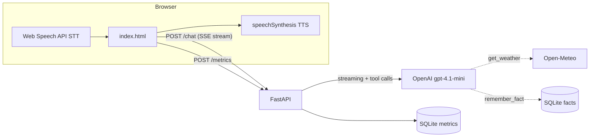

# Sarjy 🎙️

A voice assistant — built as the Sarj.ai take-home. Talk to it, it talks back,
it remembers you across sessions, and it can check real weather anywhere.
Every turn is instrumented end-to-end: the latency console in the UI shows a
per-stage waterfall with time-to-first-audio as the headline metric.

The deep dive is latency. Against a measured baseline of ~5.0 s
time-to-first-audio on a weather turn, the shipped configuration answers at
~1.96 s perceived / ~1.0 s in hold-to-talk mode — full before/after,
methodology, and failed experiments in [LATENCY.md](LATENCY.md).

Start here: [PRD.md](PRD.md) (intent) · [LATENCY.md](LATENCY.md) (results) ·
[DECISIONS.md](DECISIONS.md) (reasoning).

## Quickstart

```bash
uv sync
cp .env.example .env   # add your OPENAI_API_KEY
uv run --env-file .env uvicorn app.main:app --reload
```

Open http://127.0.0.1:8000 in **desktop Chrome or Edge**. Voice is scoped
there; mobile, Firefox, and Safari fall back to typed input in the latency
console (see Known limitations).

Tests: `uv run pytest`

## What it does

- **Voice in, voice out** — browser `SpeechRecognition` for STT,
  `speechSynthesis` for TTS. No server-side audio.
- **Remembers across sessions** — tell it "my favorite color is blue", close
  the browser, come back, ask. Facts live in SQLite keyed by a per-browser id.
- **Real external data** — current weather for any city via Open-Meteo,
  called as an LLM tool (current conditions only; forecast is a documented
  non-goal — the tool exists to demonstrate a real round-trip).

### Why Open-Meteo?

Weather is the canonical hands-free voice query — "do I need a jacket?" is
something people actually ask out loud. Open-Meteo needs no API key, so the
deployed demo works for any evaluator with zero setup and no leaked-key risk.
Its two-step flow (geocode, then forecast) also exercises a real tool
round-trip rather than a canned lookup.

## Architecture



One FastAPI app, one SQLite file, one static HTML page. Intent and scope are
in [PRD.md](PRD.md); every non-obvious choice is argued in
[DECISIONS.md](DECISIONS.md).

## Latency instrumentation

Each turn captures a waterfall across both clocks — client (a mic-energy
VAD records the true acoustic speech end that Chrome's events hide, plus
`t_transcript_final`, `t_request_sent`, `t_first_byte`,
`t_first_sentence_complete`, `t_tts_enqueue_first`, `t_stream_done`, and the
`first_audio_any`/`first_audio_content` split) and server
(`t_request_received`, `t_llm_first_token`, per-tool start/end,
`t_response_complete`). Client and server stamps are never subtracted across
clocks; the headline **time-to-first-audio** is pure client-side, so it's
immune to skew.

Two TTFA metrics are tracked and never conflated: **actual** (speech end to
first audio of substantive content) and **perceived** (to first audio of any
speech, including a tool acknowledgment). The UI renders the last turn's
waterfall in the collapsible latency console; the server stores one labelled
row per turn, and a public dashboard at `/dashboard` shows the live turn
feed, before/after bench comparisons, and a sliceable TTFA distribution.

## Configuration

| Variable          | Default        | Purpose                                      |
| ----------------- | -------------- | -------------------------------------------- |
| `OPENAI_API_KEY`  | — (required)   | LLM access                                   |
| `SARJY_MODEL`     | `gpt-4.1-mini` | Chat model (A/B-tested in LATENCY.md; wins)  |
| `SARJY_DB`        | `sarjy.db`     | SQLite file path                             |
| `SARJY_ADMIN_TOKEN` | — (unset = disabled) | Enables `/admin/db` snapshot export, `/admin/metrics/clear`, `POST /bench_runs` |

### Latency optimization flags (Phase 2 deep dive)

Every optimization is behind a toggle so improvements are individually
attributable and reverts are free. All six are ON in the deployed demo.
The evidence for each lives in [LATENCY.md](LATENCY.md); the live data is
on the public dashboard at `/dashboard`.

| Flag | What it does |
| --- | --- |
| `OPT_SENTENCE_PIPELINING` | speak sentence one while the rest of the reply streams |
| `OPT_TOOL_ACK` | spoken acknowledgment covers the tool round-trip (perceived TTFA) |
| `OPT_GEOCODE_CACHE` | SQLite city-coordinates cache halves the weather tool |
| `OPT_VAD_ENDPOINT` | our VAD endpoints tap-mode speech at `ENDPOINT_THRESHOLD_MS` (default 600; console slider) instead of Chrome's ~1.4 s |
| `OPT_KEEPALIVE` | 1-token completion ping every 45 s keeps the serving path warm through idle |
| `OPT_PREWARM` | page load fires one 1-token completion so the first turn is never cold |

## Deploy

Any Docker host works; the image respects `$PORT`.

**Railway:** new project → deploy from this repo (Dockerfile is detected) →
set `OPENAI_API_KEY` → done.

**Fly.io:** `fly launch` (accepts the Dockerfile) →
`fly secrets set OPENAI_API_KEY=...` → `fly deploy`.

Local Docker:

```bash
docker build -t sarjy .
docker run -p 8000:8000 -e OPENAI_API_KEY=sk-... sarjy
```

Note: the deployed demo keeps SQLite on a Railway volume, so facts and
metrics survive redeploys. Managed Postgres would be the move only if live
multi-client inspection became a requirement (parked in IDEAS.md).

## Known limitations

- Voice input is scoped to desktop Chrome/Edge; mobile and other browsers
  fall back to typed input (a deliberate scope boundary — see DECISIONS.md).
- With `OPT_SENTENCE_PIPELINING` (on by default), TTS starts on the first
  sentence while the rest streams; the conservative splitter can mis-split
  on a rare mid-sentence abbreviation, accepted for spoken-style replies.
- Session history is in-process RAM (a restart forgets the current
  conversation, never the stored facts).
- No auth: the per-browser UUID scopes memory but is not a security boundary.
