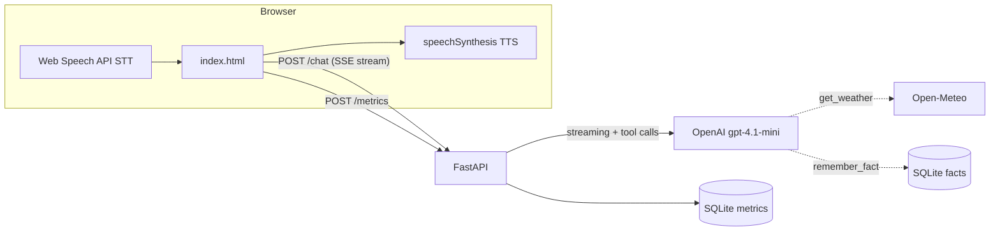

# Sarjy 🎙️

A voice assistant — built as the Sarj.ai take-home. Talk to it, it talks back,
it remembers you across sessions, and it can check real weather anywhere.
Every turn is instrumented end-to-end: the latency console in the UI shows a
per-stage waterfall with time-to-first-audio as the headline metric.

## Quickstart

```bash
uv sync
cp .env.example .env   # add your OPENAI_API_KEY
uv run --env-file .env uvicorn app.main:app --reload
```

Open http://127.0.0.1:8000 in **Chrome or Edge** (the Web Speech API doesn't
ship in Firefox/Safari — there's a typed fallback in the latency console).

Tests: `uv run pytest`

## What it does

- **Voice in, voice out** — browser `SpeechRecognition` for STT,
  `speechSynthesis` for TTS. No server-side audio.
- **Remembers across sessions** — tell it "my favorite color is blue", close
  the browser, come back, ask. Facts live in SQLite keyed by a per-browser id.
- **Real external data** — current weather for any city via Open-Meteo,
  called as an LLM tool.

### Why Open-Meteo?

Weather is the canonical hands-free voice query — "do I need a jacket?" is
something people actually ask out loud. Open-Meteo needs no API key, so the
deployed demo works for any evaluator with zero setup and no leaked-key risk.
Its two-step flow (geocode, then forecast) also exercises a real tool
round-trip rather than a canned lookup.

## Architecture



One FastAPI app, one SQLite file, one static HTML page. The full request flow
with every timestamp is in [PLAN.md](PLAN.md); every non-obvious choice is
argued in [DECISIONS.md](DECISIONS.md).

## Latency instrumentation

Each turn captures a waterfall across both clocks — client
(`t_speech_end_vad` from a mic-energy VAD that catches the true acoustic
speech end Chrome's events hide, `t_speech_end`, `t_transcript_final`,
`t_request_sent`, `t_first_byte`, `t_stream_done`, `t_tts_start`,
`t_first_audio`) and server
(`t_request_received`, `t_llm_first_token`, per-tool start/end,
`t_response_complete`). Client and server stamps are never subtracted across
clocks; the headline **time-to-first-audio** is pure client-side, so it's
immune to skew. The UI renders the last turn's waterfall in the collapsible
latency console; the server logs one JSON line per turn and persists it to
the `metrics` table for offline analysis.

## Configuration

| Variable         | Default        | Purpose                          |
| ---------------- | -------------- | -------------------------------- |
| `OPENAI_API_KEY` | — (required)   | LLM access                       |
| `SARJY_MODEL`    | `gpt-4.1-mini` | Chat model (swap for A/B tests)  |
| `SARJY_DB`       | `sarjy.db`     | SQLite file path                 |

## Deploy

Any Docker host works; the image respects `$PORT`.

**Railway:** new project → deploy from this repo (Dockerfile is detected) →
set `OPENAI_API_KEY` → done.

**Fly.io:** `fly launch` (accepts the Dockerfile) →
`fly secrets set OPENAI_API_KEY=...` → `fly deploy`.

Local Docker:

```bash
docker build -t sarjy .
docker run -p 8000:8000 -e OPENAI_API_KEY=sk-... sarjy
```

Note: SQLite lives on the container filesystem — fine for a demo; a volume
(or managed Postgres) would be the first change for anything real.

## Known limitations

- STT requires a Chromium browser; the typed fallback covers the rest.
- TTS speaks only after the full reply streams in — deliberate Phase 1
  baseline; sentence-chunked streaming TTS is the Phase 2 deep-dive work.
- Session history is in-process RAM (a restart forgets the current
  conversation, never the stored facts).
- No auth: the per-browser UUID scopes memory but is not a security boundary.
